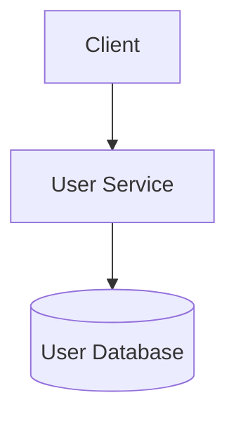

# PayFlow System Architecture

## Current Status

The system architecture will evolve incrementally as
new microservices and infrastructure components are introduced.

## Initial Service Architecture

### User Service Responsibility

The User Service manages user-related operations and owns user data.

Other microservices should not directly access the User Service database.
They should communicate with the User Service through APIs.

## Planned Components

- API Gateway
- User Service
- Wallet Service
- Transaction Service
- Payment Service
- Notification Service
- Fraud/Risk Service
- Service Registry
- Config Server
- Kafka